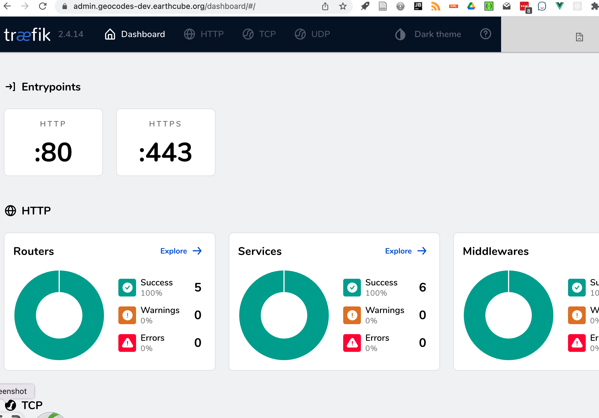

##  Setup Machine:

# services:
This is what will be needed to create a production server
* base virtual machine for containers
* ability to request DNS,

### Steps:

* create a machine in openstack (if production)
  * select size
  * associate floating IP
    * ask for DNS for that ip to be configured with needed names
* ssh to machine. You do not need to have the DNS's to install the software. But it will be needed.
  * update apt
    * `sudo apt update`
  * update base software
    * `sudo apt upgrade`
  * install docker
    * `sudo apt install docker.io`
  * reboot
    * `sudo reboot now`
  * verify proper base configuration
    * docker compose --help shows a -p flag
* clone geocodes
* `git clone https://github.com/earthcube/geocodes.git`
* configure a base server


----


## create a machine in openstack
#### Suggested size:
SDSC Openstack:
- ubuntu 22
- 500 gig
  - m1.2xlarge (8 CPU, 32 gig)
  - network: earthcube
-  Security groups:
  - remote ssh
  - geocodes
- Keypair: earthcube


 **Notes:**
  Portainer, minio not needed, we are proxying on 80 and 443

**Associate a Public IP.**
After the machine is created, we can change the IP to the one associated with geocodes.earthcube.org

# setup domain names
It is ESSENTIAL for PRODUCTION that the names are defined in a DNS. This allows for https for all services
and some services (aka s3/minio) do not play well with a proxy. (Fuseki unknown)

   [Machines]( stack_machines.md )
   [Name for remote DNS](../deployment/hosts.geocodes)

You might be able to run production stack using localhost, with these DNS...
but that mucks with the lets encrypt HTTPS certs... if you control your own DNS, these are the 
entries needed.
   [Name for local DNS](../deployment/hosts.geocodes-local)

[Local testing and development](local_developer/index.md) can be using  the local compose configuration. This use http, and 
local ports for services that cannot be proxied

## ssh to machine and verify

ssh -i ~/.ssh/earthcube.pem ubuntu@{public IP}


## configure a base server
  * add docker, git
  * git clone https://github.com/earthcube/geocodes.git
  * cd geocodes/deployment
  * copy env.example, to {myhost}.env
     * modify the file
  * modify the treafik-data/traefik.yml
     *  [lets encrypt](https://doc.traefik.io/traefik/https/acme/), 
        * (developers) set to use [staging environment](https://letsencrypt.org/docs/staging-environment/) server while testing
```    
   acme:
      # using staging for testing/development
 #     caServer: https://acme-staging-v02.api.letsencrypt.org/directory
      email: example@earthcube.org
      storage: acme.json
      httpChallenge:
        entryPoint: http
```
     
  * start the base containers 
    * developer
      * ./run_base.sh -e {your environment file}
    * production: this uses the default portainer.env
      * ./run_base.sh 
```      
      ubuntu@geocodes-dev:~/geocodes/deployment$ ./run_base.sh
      Error response from daemon: network with name traefik_proxy already exists
      NETWORK ID     NAME              DRIVER    SCOPE
      ad6cbce4ec60   bridge            bridge    local
      2f618fa7da6d   docker_gwbridge   bridge    local
      f8048bc7a3d9   host              host      local
      kibdi510bt0x   ingress           overlay   swarm
      12c01a2186b0   none              null      local
      u4d4oxfy7olc   traefik_proxy     overlay   swarm
      Verify that the traefik_proxy network SCOPE is swarm
      traefik_data
      portainer_data
      true
      [+] Running 2/2
      ⠿ Container portainer  Started                                           13.7s
      ⠿ Container traefik    Started
```
      
  * Are containers running
    * `docker ps`
```
    * ubuntu@geocodes-dev:~/geocodes/deployment$ docker ps
      CONTAINER ID   IMAGE                           COMMAND                  CREATED         STATUS         PORTS                                                                      NAMES
      09a5d8683cce   traefik:v2.4                    "/entrypoint.sh trae…"   2 minutes ago   Up 2 minutes   0.0.0.0:80->80/tcp, :::80->80/tcp, 0.0.0.0:443->443/tcp, :::443->443/tcp   traefik
      d3e2333ade6f   portainer/portainer-ce:latest   "/portainer"             2 minutes ago   Up 2 minutes   8000/tcp, 9000/tcp, 9443/tcp                                               portainer
```
  * Is network setup correctly?
    * `docker network ls`
```      docker network ls
      NETWORK ID     NAME              DRIVER    SCOPE
      ad6cbce4ec60   bridge            bridge    local
      2f618fa7da6d   docker_gwbridge   bridge    local
      f8048bc7a3d9   host              host      local
      kibdi510bt0x   ingress           overlay   swarm
      12c01a2186b0   none              null      local
      u4d4oxfy7olc   traefik_proxy     overlay   swarm
```
NAME:traefik_proxy needs to exist, and be DRIVER:overlay, SCOPE:swarm

  * Are volumes available
    * `docker volumes`
```     ubuntu@geocodes-dev:~$ docker volume ls
      DRIVER    VOLUME NAME
      local     graph
      local     minio
      local     portainer_data
      local     traefik_data
```

### is the base running?
  * are Traefik and Portainer available via the web?
    * **Treafik** https://admin.{host}
      * login is admin:iforget
  
    * **Portainer** https://portainer.{host}/
      * this will ask you to setup and admin password


## How tos needed:
* LOCAL DNS SETUP
  * editing hosts does not work with letsencrypt. If user has a local name server they control, that might work
* setup a new password for traefik
* lets encrypt
