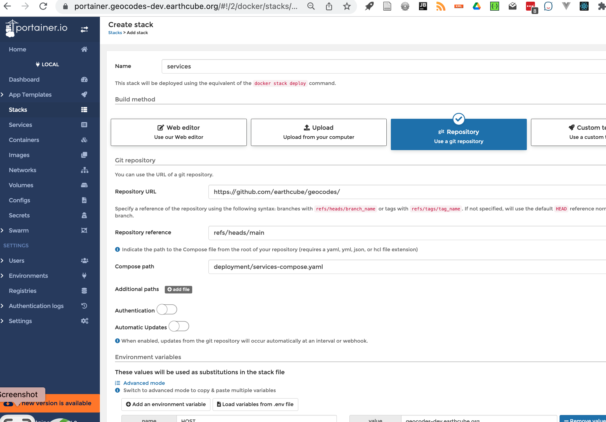

#  Setup Geocodes Services  Containers:

This is step 2 of 4 major steps:

1. [Install base containers on a server](../stack_machines.md)
2. [Setup services containers](setup_geocodes_services_containers.md)
3. [Initial setup of services and loading of data](./setup_indexing_with_gleanerio.md)
4. [Setup Geocodes UI using datastores defined in Initial Setup](../setup_geocodes_ui_containers.md)

## Services Stack
The services stack includes the graph, storage (s3) and sparql gui containers.
JSON-LD files are 'summoned' by gleaner to the s3 storage, and nabu convert jsonld to rdf quads
and pushes the results to the graph. 
After uploading, a step to produce a materialized view is required to improve performance
The summarize step is undocoumented at present.


### create a new env file

* cd deployment
* Edit files containing env variables
  * copy portainer.services.env to new file.` cp portainer.env {myhost}.services.env`
  * copy portainer.geocodes.env to new file.` cp portainer.geocodes.env {myhost}.geocodes.env`
  * (option) use single file copy portainer.env to new file.` cp portainer.env {myhost}.env`
  * edit {myhost}.{geocodes|services}.env
    * change
???+ example "env"
    ```{ .copy }
    HOST=geocodes-dev.mydomain.org
    PRODUCTION=geocodes.mydomain.org
    GC_CLIENT_DOMAIN=geoccodes.geocodes-dev.mydomain.org
    S3ADDRESS=oss.geocodes-dev.mydomain.org
    ```

### Setup and start services using portainer ui

#### Create Services Stack

* log into portainer
    * if this is a first login, it will ask you for a password.
    * Select **stack** tab
    * click **add stack** button
```
Name: services
Build method: git repository
Repository URL: https://github.com/earthcube/geocodes
Reference: refs/heads/main
Compose path: deployment/services-compose.yaml
```
    * Environment variables: click 'load variables from .env file'
        * load {myhost}.services.env
    * Actions: 
        * Click: Deploy This Stack 
??? example "Services Stack"
    


## Go to step 3.

1. [Install base containers on a server](../stack_machines.md)
2. [Setup services containers](setup_geocodes_services_containers.md)
3. [Initial setup of services and loading of data](./setup_indexing_with_gleanerio.md)
4. [Setup Geocodes UI using datastores defined in Initial Setup](../setting_up_user_interface/setup_geocodes_ui_containers.md)
5. 
#### Testing Services Stack
