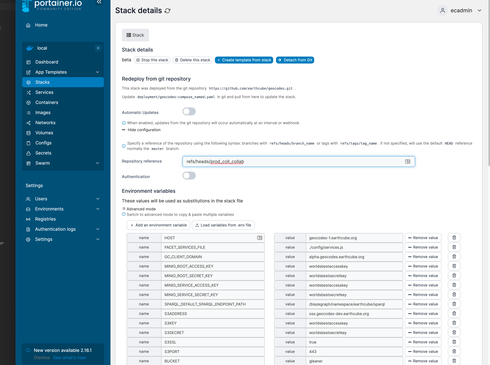
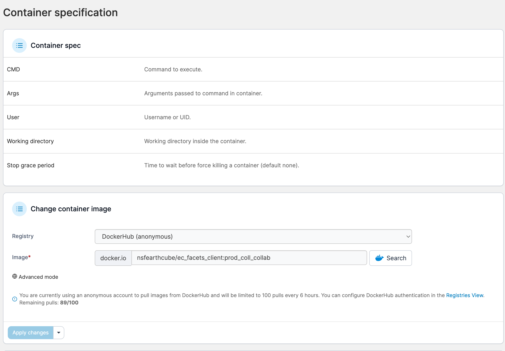

#  Setup Geocodes Services and Geocodes Client Containers:

## Services Stack


### create a new env file

* cd deployment
* Edit files containing env variables
  * copy portainer.services.env to new file.` cp portainer.env {myhost}.services.env`
  * copy portainer.geocodes.env to new file.` cp portainer.geocodes.env {myhost}.geocodes.env`
  * (option) use single file copy portainer.env to new file.` cp portainer.env {myhost}.env`
  * edit {myhost}.{geocodes|services}.env
    * change
???+ example "env"
    ```{ .copy }
    HOST=geocodes-dev.mydomain.org
    PRODUCTION=geocodes.mydomain.org
    GC_CLIENT_DOMAIN=geoccodes.geocodes-dev.mydomain.org
    S3ADDRESS=oss.geocodes-dev.mydomain.org
    ```

### Setup and start services using portainer ui

#### Create Services Stack

* log into portainer
    * if this is a first login, it will ask you for a password.
    * Select **stack** tab
    * click **add stack** button
```
Name: services
Build method: git repository
Repository URL: https://github.com/earthcube/geocodes
Reference: refs/heads/main
Compose path: deployment/services-compose.yaml
```
    * Environment variables: click 'load variables from .env file'
        * load {myhost}.services.env
    * Actions: 
        * Click: Deploy This Stack 
??? example "Services Stack"
    

#### Testing Services Stack

----

## Setup and start GeoCodes Client using portainer ui
Steps:

* modify the configuration file
* create stack in portainer
* test
* instructions for Updating a GEOCODES CLIENT Configuration if things do not work
    * or delete stack and reload


###  Modify the Facet Search Configuration

* edit in deployment/facets/config.yaml
* this file is mounted on the container as a docker config file
    * **run** the run_add_configs.sh

Portions of deployment/facets/config.yaml that might be changed.
??? example "section of deployment/facets/config.yaml"
    ```{.yaml .copy}
    API_URL: https://geocodes.{your host}/ec/api/
    SPARQL_NB: https:/geocodes.{your host}/notebook/mkQ?q=${q}
    SPARQL_YASGUI: https://geocodes.{your host}/sparqlgui?
    #API_URL: "${window_location_origin}/ec/api"
    #TRIPLESTORE_URL: https://graph.geocodes-1.earthcube.org/blazegraph/namespace/earthcube/sparql
    TRIPLESTORE_URL: https://graph.{your host}/blazegraph/namespace/earthcube/sparql
    BLAZEGRAPH_TIMEOUT: 20
    ## ECRR need to use fuseki source, for now.
    ECRR_TRIPLESTORE_URL: http://132.249.238.169:8080/fuseki/ecrr/query 
    # ECRR_TRIPLESTORE_URL:   http://{your host}/blazegraph/namespace/ecrr/sparql 
    ECRR_GRAPH: http://earthcube.org/gleaner-summoned
    THROUGHPUTDB_URL: https://throughputdb.com/api/ccdrs/annotations
    SPARQL_QUERY: queries/sparql_query.txt
    SPARQL_HASTOOLS: queries/sparql_hastools.txt
    SPARQL_TOOLS_WEBSERVICE: queries/sparql_gettools_webservice.txt
    SPARQL_TOOLS_DOWNLOAD: queries/sparql_gettools_download.txt
    # JSONLD_PROXY needs qoutes... since it has a $
    JSONLD_PROXY: "https://geocodes.{your host}/ec/api/${o}"
    
    SPARQL_YASGUI: https://sparqlui.{your host}/?
    ```

### Create Geocodes Stack

* log into portainer
    * if this is a first login, it will ask you for a password.
    * click **add stack** button
```text
Name: geocodes
Build method: git repository
Repository URL: https://github.com/earthcube/geocodes
reference: refs/heads/main
Compose path: deployment/geocodes-compose.yaml
```
    * Environment variables: click 'load variables from .env file'
        * load {myhost}.geocodes.env
    * Actions:
        * Click: Deploy This Stack
??? note "Geocodes Stack "
    

### Test Geocodes Client
There will be no data initially, so queries will not work but

1.  Got to https://geocodes.{your host}/
1. Got to configuration: https://geocodes.{your host}/#/config
   * Two sections, one is the facests/config.yaml and the second is the API configuration (sanitized, we hope)

### Updating a GEOCODES CLIENT Configuration

You can modify the facets_config config, in order to do this, stop the stack,
delete the config and recreate the config.

1. go to portainer, 
1. select geocodes_geocodes, stop
2. select config, facets_config, copy content, select delete
3. create a new config with name 'facets_config', paste in content
4. modify content, save
5. restart stack 
6. update the service 
    7. services, geocodes_vue-client or geocodes_xxx_vue-client
    8. udate the service
*** NOTE: TRY A SECOND BROWSER... and/or Clear browser cache ****
    9. If that does not work, check to see in services if the correct container image is being pulled.
9. Then go to containers, geocodes_vue-client or geocodes_xxx_vue-client
    10. remove container. It will rebuild if it is not stopped 


---

## DEVELOPERS: Testing a UI Branch in Portainer/Docker

> :memo: An Update May be needed. You can now deploy a tennant configuration, which many mean that geocodes repo changes 
> may not be needed 

> :memo: you should do local development before deployment testing

To do this we will need to do two branches, one on the facet search, and one on the services stack geocodes.
Or, you can disconnect your development services 

### Facetsearch repository changes

* create a branch
  * on that branch edit the github workflows/docker_xxx add your branch
 
```yaml
on:
  push:
    branches:
    - master
    - feat_summary
```

* make changes and push

### geocodes repository changes

* create a branch
* modify   deployment/geocodes-compose.yaml 
```yaml
vue-services:
  image: nsfearthcube/ec_facets_api_nodejs:{{BRANCH NAME}}
  ```

```yaml
vue-client:
  image: nsfearthcube/ec_facets_client:{{BRANCH NAME}}
  ```

### Deployment in in portainer

* create a new stack
* under advanced configuration
??? example "stack deploy from a branch"
    
* save
* pull and deploy


----

## Troubleshooting

### seems like  the container is not getting updated
occasionally, a branch is being used for a stack. This will  be true of alpha/beta/tennant
containers.

* open stack
* user Redeploy from Git: select advanced configuration
* change the branch information
??? example "stack deploy from a branch"
    

Occasionally, the latest will not be pulled, Seen  when I  change a branch,

* open services, 
* select a service, 
* go down to Change container image
* set to the appropriate container path.
??? example "stack deploy from a branch"
    
