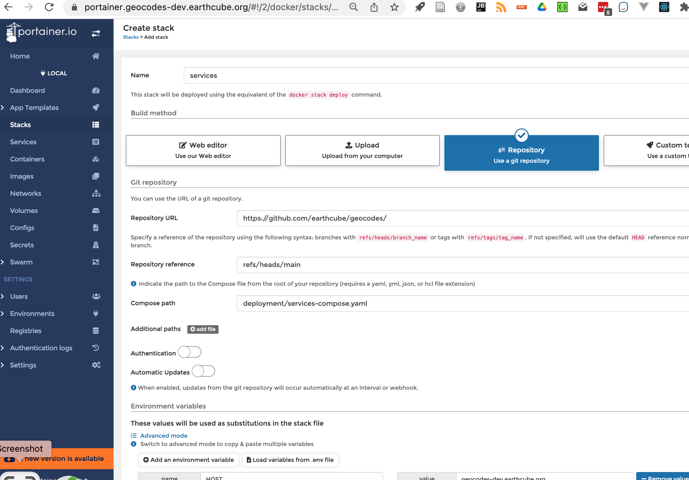

##  Setup Geocodes Containers:
  * create a new env file
    * cd deployment
    * copy portainer.env to new file.` cp portainer.env {myhost}.env`
    * edit {myhost}.env
      * change 
        * HOST
        * domains (aka GLEANER_)
        *  Object store keys
        * SPARQL GUI
        *  api
  * Setup and start services using portainer ui
    * log into portainer
      * if this is a first login, it will ask you for a password.
    * Select **stack** tab
    * Create Services Stack
      * click **add stack** button
          * Name: services
          * Build method: git repository
          * Repository URL: https://github.com/earthcube/geocodes
          * reference: refs/heads/main
          * Compose path: deployment/services-compose.yaml
          * Environment variables: click 'load variables from .env file'
            * load {myhost}.env
          * Actions: 
            * Click: Deploy This Stack 
  
    * Create Geocodes Stack
      * click **add stack** button
        * Name: geocodes
        * Build method: git repository
        * Repository URL: https://github.com/earthcube/geocodes
        * reference: refs/heads/main
        * Compose path: deployment/geocodes-compose.yaml
        * Environment variables: click 'load variables from .env file'
          * load {myhost}.env
        * Actions:
          * Click: Deploy This Stack
    

    
