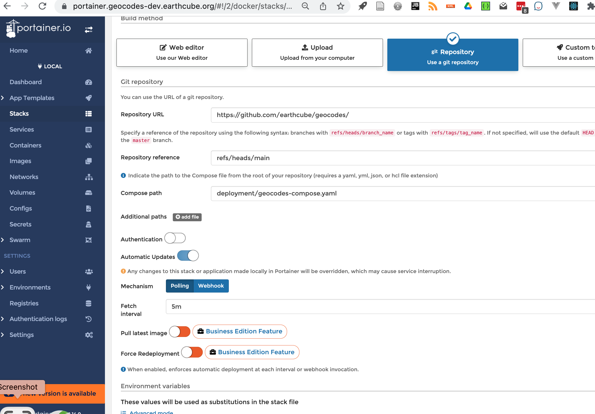

##  Setup Geocodes Containers:
  * create a new env file
    * cd deployment
    * Edit files containing env variables
      * copy portainer.services.env to new file.` cp portainer.env {myhost}.services.env`
      * copy portainer.geocodes.env to new file.` cp portainer.geocodes.env {myhost}.geocodes.env`
      * (option) use single file copy portainer.env to new file.` cp portainer.env {myhost}.env`
      * edit {myhost}.{geocodes|services}.env
        * change 
          * HOST
          * domains (aka GLEANER_)
          *  Object store keys
          * SPARQL GUI
          *  api
  * Modify the Facet Search Configuration
     * edit in deployment/facets/config.yaml
     * this file is mounted on the container as a docker config file
       * run the run_add_configs.sh
```yaml
API_URL: https://geocodes.{your host}/ec/api/
SPARQL_NB: https:/{your host}/notebook/mkQ?q=${q}
SPARQL_YASGUI: https://geocodes.{your host}/sparqlgui?
#API_URL: "${window_location_origin}/ec/api"
#TRIPLESTORE_URL: https://graph.geodex.org/blazegraph/namespace/earthcube/sparql
TRIPLESTORE_URL: https://{your host}/blazegraph/namespace/earthcube/sparql
BLAZEGRAPH_TIMEOUT: 20
ECRR_TRIPLESTORE_URL: http://{your host}blazegraph/namespace/ecrr/sparql
ECRR_GRAPH: http://earthcube.org/gleaner-summoned
THROUGHPUTDB_URL: https://throughputdb.com/api/ccdrs/annotations
SPARQL_QUERY: queries/sparql_query.txt
SPARQL_HASTOOLS: queries/sparql_hastools.txt
SPARQL_TOOLS_WEBSERVICE: queries/sparql_gettools_webservice.txt
SPARQL_TOOLS_DOWNLOAD: queries/sparql_gettools_download.txt
JSONLD_PROXY: "https://geocodes.{your host}/ec/api/${o}"
```
  * Setup and start services using portainer ui
    * log into portainer
      * if this is a first login, it will ask you for a password.
    * Select **stack** tab
    * Create Services Stack
      * click **add stack** button
          * Name: services
          * Build method: git repository
          * Repository URL: https://github.com/earthcube/geocodes
          * reference: refs/heads/main
          * Compose path: deployment/services-compose.yaml
          * Environment variables: click 'load variables from .env file'
            * load {myhost}.services.env
          * Actions: 
            * Click: Deploy This Stack 
  
    * Create Geocodes Stack
      * click **add stack** button
        * Name: geocodes
        * Build method: git repository
        * Repository URL: https://github.com/earthcube/geocodes
        * reference: refs/heads/main
        * Compose path: deployment/geocodes-compose.yaml
        * Environment variables: click 'load variables from .env file'
          * load {myhost}.geocodes.env
        * Actions:
          * Click: Deploy This Stack
    

#### Modifying a Configuration

You can modify the facets_config config, in order to do this, stop the stack,
delete the config and recreate the config.

1. go to portainer, 
1. select geocodes_geocodes, stop
2. select config, facets_config, copy content, select delete
3. create a new config with name 'facets_config', paste in content
4. modify content, save
5. restart stack

#### Testing a UI Branch
To do this we will need to do two branches, one on the facet search, and one on the geocodes.

 **Facetsearch** 
* create a branch
  * on that branch edit the github workflows/docker_xxx add your branch
```yaml
on:
  push:
    branches:
    - master
    - feat_summary
```
* make changes and push

**geocodes**
* create a branch
* modify   deployment/geocodes-compose.yaml 
```yaml
vue-services:
  image: nsfearthcube/ec_facets_api_nodejs:{{BRANCH NAME}}
  ```

```yaml
vue-client:
  image: nsfearthcube/ec_facets_client:{{BRANCH NAME}}
  ```

in portainer
* create a new stack
* under advanced configuration

* save
* pull and deploy

#### Troubleshooting

##### seems like  the container is not getting updated
occassionally, a branch is being used for a stack. This will  be true of alpha/beta/tennant
containers.

* open stack
* user Redeploy from Git: select advanced configuration
* change the branch information


Occassionaly, the latest will not be pulled, Seen  when I  change a branch,

* open services, 
* select a service, 
* go down to Change container image
* set to the appropriate container path.

