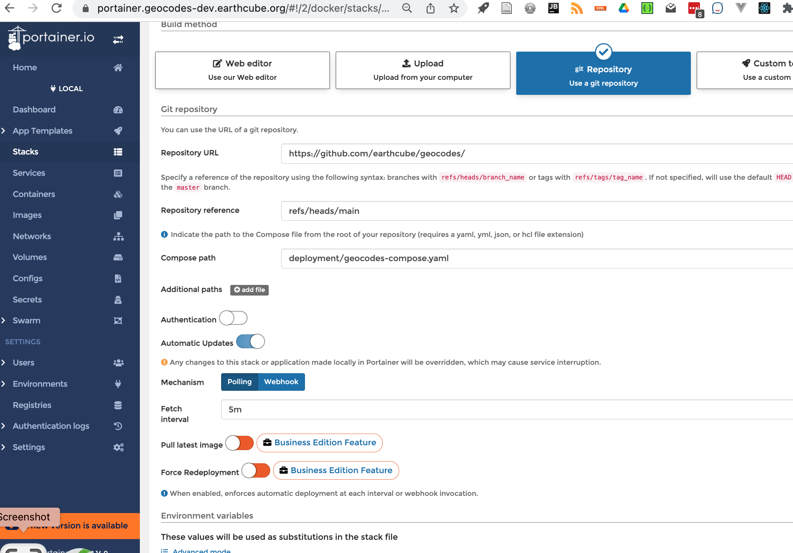

#  Setup Geocodes Services Containers:

This is step 4 of 4 major steps:

1. [Install base containers on a server](./stack_machines.md)
2. [Setup services containers](./setup_geocodes_services_containers.md)
3. [Initial setup of services and loading of data](./setup_indexing_with_gleanerio.md)
4. [Setup Geocodes UI using datastores defined in Initial Setup](./setup_geocodes_ui_containers.md)

## Setup and start GeoCodes Client using portainer ui
Steps:

* modify the configuration file
* create stack in portainer
* test
* instructions for Updating a GEOCODES CLIENT Configuration if things do not work
    * or delete stack and reload


###  Modify the Facet Search Configuration

* edit in deployment/facets/config.yaml
* this file is mounted on the container as a docker config file
    * **run** the run_add_configs.sh

Portions of deployment/facets/config.yaml that might be changed.
??? example "section of deployment/facets/config.yaml"
    ```{.yaml .copy}
    API_URL: https://geocodes.{your host}/ec/api/
    SPARQL_NB: https:/geocodes.{your host}/notebook/mkQ?q=${q}
    SPARQL_YASGUI: https://geocodes.{your host}/sparqlgui?
    #API_URL: "${window_location_origin}/ec/api"
    #TRIPLESTORE_URL: https://graph.geocodes-1.earthcube.org/blazegraph/namespace/earthcube/sparql
    TRIPLESTORE_URL: https://graph.{your host}/blazegraph/namespace/earthcube/sparql
    BLAZEGRAPH_TIMEOUT: 20
    ## ECRR need to use fuseki source, for now.
    ECRR_TRIPLESTORE_URL: http://132.249.238.169:8080/fuseki/ecrr/query 
    # ECRR_TRIPLESTORE_URL:   http://{your host}/blazegraph/namespace/ecrr/sparql 
    ECRR_GRAPH: http://earthcube.org/gleaner-summoned

    THROUGHPUTDB_URL: https://throughputdb.com/api/ccdrs/annotations
    SPARQL_QUERY: queries/sparql_query.txt
    SPARQL_HASTOOLS: queries/sparql_hastools.txt
    SPARQL_TOOLS_WEBSERVICE: queries/sparql_gettools_webservice.txt
    SPARQL_TOOLS_DOWNLOAD: queries/sparql_gettools_download.txt
    # JSONLD_PROXY needs qoutes... since it has a $
    JSONLD_PROXY: "https://geocodes.{your host}/ec/api/${o}"
    
    SPARQL_YASGUI: https://sparqlui.{your host}/?
    ```

### Create Geocodes Stack

* log into portainer
    * if this is a first login, it will ask you for a password.
    * click **add stack** button
```text
Name: geocodes
Build method: git repository
Repository URL: https://github.com/earthcube/geocodes
reference: refs/heads/main
Compose path: deployment/geocodes-compose.yaml
```
    * Environment variables: click 'load variables from .env file'
        * load {myhost}.geocodes.env
    * Actions:
        * Click: Deploy This Stack
??? note "Geocodes Stack "
    

### Test Geocodes Client

!!! important "Issues"
IF things are not working in the UI, it is probably the facet search configuration
You can take down the geocodes stack, and delete the config/facets_search or you can
possibly just stop the gecodes_vue_ui service, and edit the facets_search config as
noted here: [See Managing Geocodes UI Containers](production/managing_geocodes_ui_containers.md)

1.  Got to https://geocodes.{your host}/
1. Got to configuration: https://geocodes.{your host}/#/config
   * Two sections, one is the facests/config.yaml and the second is the API configuration (sanitized, we hope)

!!! note "Done"
This is the end of the deployment steps.
